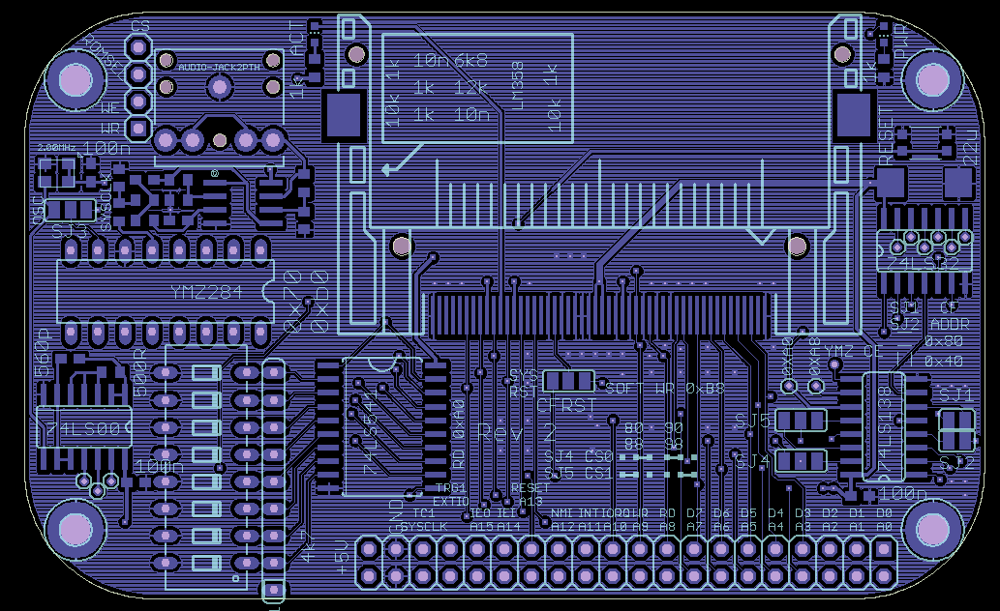
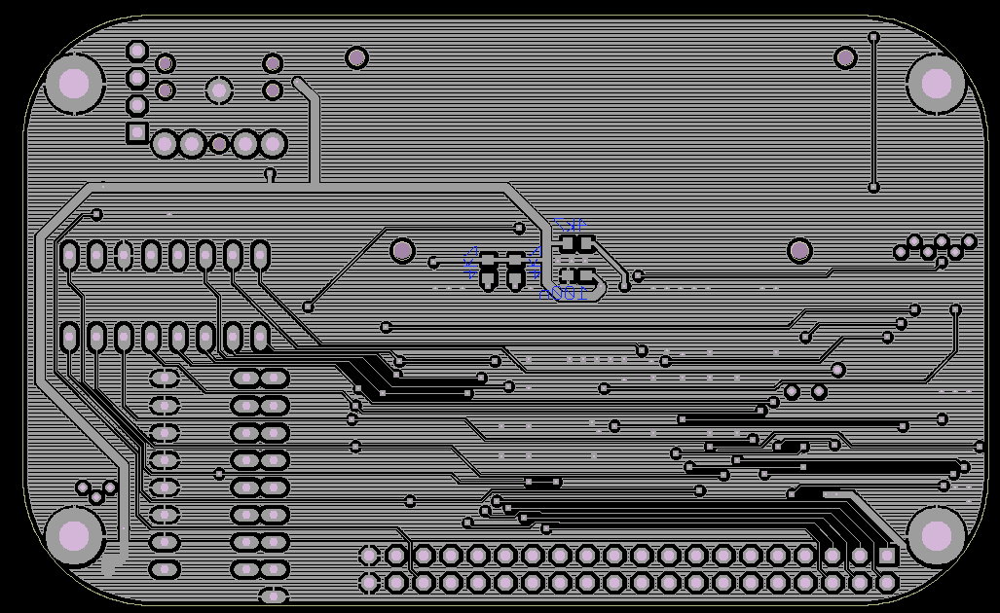

# Revision 2
Changes:
* Add RESET switch and POWER LED to CF board where they are more conveniently reachable.
* Add pass through jumper for EEPROM WR and CS connections. Mainly so that WR jumper is easier to reach.
* Change TTL frequency generator resistor value. Circuit did not work with 200R. 500R seems to be the minimum.
* Add buffer between TTL generator and YMZ chip
* Add soft reset option for CF card on write to 0xa8 port
* Add configuration switch on read from 0xb8 port

Come to think of it, this should be the same port 0xb8 since read and write do not conflict with one another. 
This will be changed in Rev 2a. Already done in CAD but since Rev 2 PCBs arrive today, 
I will build one of them to play with.

